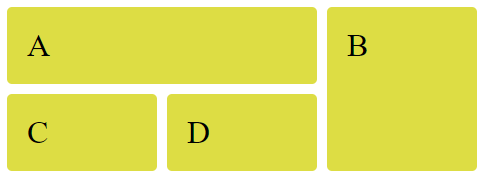
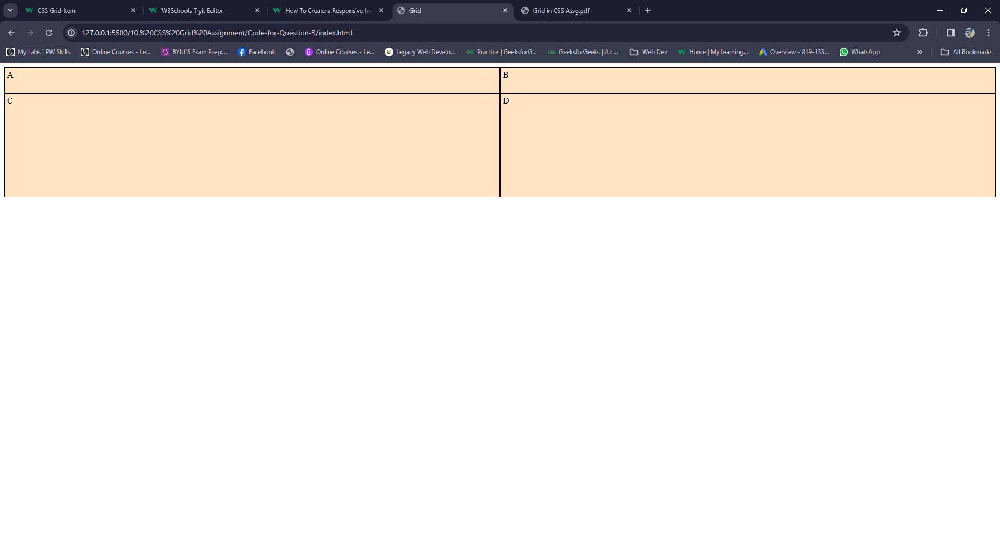
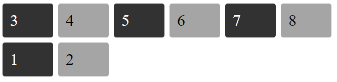
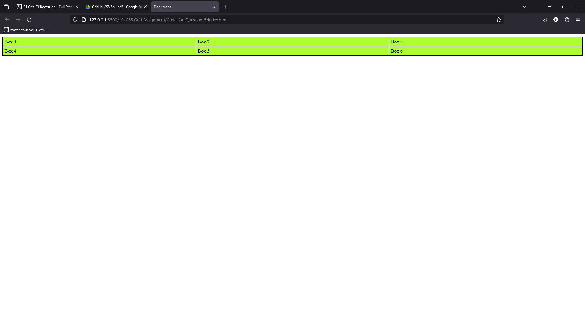

## 1. Create an Image gallery using a CSS grid.
### index.html
```HTML
<!DOCTYPE html>
<html lang="en">
<head>
    <meta charset="UTF-8">
    <meta name="viewport" content="width=device-width, initial-scale=1.0">
    <title>Image Gallery</title>
    <style>
        .container{
            display: grid;
            grid-template-columns: repeat(3, 1fr);
            grid-template-rows: repeat(3,200px);
            padding: 15px;
            gap: 15px;
        }
        img{
         width: 100%;  
         height: 100%; 
         border-radius: 10px;
        }
        .img-1{
            grid-column: 1/3;
            grid-row: 1/2;
        }
        .img-3{
            grid-row: 2/4;
        }
        .img-6{
            grid-column: 3;
            grid-row:2/4;
        }
    </style>
</head>
<body>
    <div class="container">
        <div class="img-1"></div>
        <div class="img-2"></div>
        <div class="img-3"></div>
        <div class="img-4"></div>
        <div class="img-5"></div>
        <div class="img-6"></div>
    </div>
</body>
</html>
```

### Output:


## 2. Write code to arrange containers with texts A, B, C, and D as show in the below image.

### index.html
```HTML
<!DOCTYPE html>
<html lang="en">
<head>
    <meta charset="UTF-8">
    <meta name="viewport" content="width=device-width, initial-scale=1.0">
    <title>Grid</title>
    <style>
        .container{
            display: grid;
            grid-template-columns: repeat(3,150px);
            gap:10px;
        }
        .container div{
            background-color: #dddd44;
            font-size: 2rem;
            border-radius: 5px;
            padding: 20px;
        }
        .box-A{
            grid-column: 1/3;
        }
        .box-B{
            grid-column: 3;
            grid-row: 1/3;
        }
    </style>
</head>
<body>
    <div class="container">
        <div class="box-A">A</div>
        <div class="box-B">B</div>
        <div class="box-C">C</div>
        <div class="box-D">D</div>
    </div>
</body>
</html>
```

### Output:


## 3. Explain the use of grid-auto-row and grid-auto-column using code examples.

### Answer:
grid-auto-rows and grid-auto-column properties specify the height and width of rows that are automatically
created when there is no explicit row definition and column definition respectively.

### index.html
```HTML
<!DOCTYPE html>
<html lang="en">
<head>
    <meta charset="UTF-8">
    <meta name="viewport" content="width=device-width, initial-scale=1.0">
    <title>Grid</title>
    <style>
        .container {
            display: grid;
            grid-template-areas: "X X";
            grid-template-rows: 50px;
            grid-auto-rows: 200px;
        }
        .container > div {
            border: 1px solid black;
            background-color: bisque;
            padding: 5px;
        }
    </style>
</head>
<body>
    <div class="container">
        <div class="box-A">A</div>
        <div class="box-B">B</div>
        <div class="box-C">C</div>
        <div class="box-D">D</div>
    </div>
</body>
</html>
```

### Output:


## 4. Write CSS to show numbers as shown in the figure, without altering the html file.

### index.html
```HTML
<!DOCTYPE html>
<html lang="en">
<head>
    <meta charset="UTF-8">
    <meta name="viewport" content="width=device-width, initial-scale=1.0">
    <title>Grid</title>
    <style>
        .container{
            display: grid;
            grid-template-columns: repeat(6,100px);
            gap:10px
        }
        .container div{
            font-size: 2rem;
            padding: 15px;
            border-radius: 5px;
        }
        .container div:nth-child(odd){
            background-color: #323232;
            color: #fff;
        }
        .container div:nth-child(even){
            background-color: #a5a5a5;
        }
        .item-3{
            order:-1;
        }
        .item-2{
            order:2;
        }
        .item-1{
            order:1;
        }
    </style>
</head>
<body>
    <div class="container">
        <div class="item-1">1</div>
        <div class="item-2">2</div>
        <div class="item-3">3</div>
        <div class="item-4">4</div>
        <div class="item-5">5</div>
        <div class="item-6">6</div>
        <div class="item-7">7</div>
        <div class="item-8">8</div>
    </div>
</body>
</html>
```

### Output:


## 5. Explain the difference between justify-self using code examples.
### Answer:
The main difference between them is that justify-items apply to grid containers and justify-self applies to grid-
items.

Let us understand them by taking an example, below code, for example having 6 grid items arranged in a 3x2
grid.

### index.html
```HTML
<!DOCTYPE html>
<html lang="en">
  <head>
    <meta charset="UTF-8" />
    <meta name="viewport" content="width=device-width, initial-scale=1.0" />
    <title>Document</title>
    <style>
      .container {
        display: grid;
        grid-template-columns: auto auto auto;
        border: 1px solid black;
      }

      .container > div {
        padding: 5px;
        background-color: greenyellow;
        border: 1px solid black;
      }
    </style>
  </head>

  <body>
    <div class="container">
      <div class="box1">Box 1</div>
      <div class="box2">Box 2</div>
      <div class="box3">Box 3</div>
      <div class="box4">Box 4</div>
      <div class="box5">Box 5</div>
      <div class="box6">Box 6</div>
    </div>
  </body>
</html>

```

### output:

