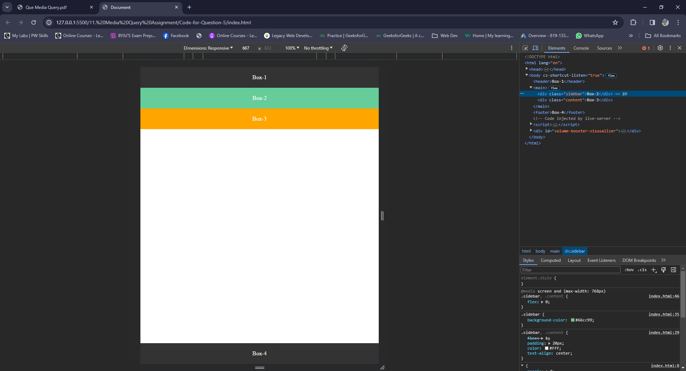

## 1. Create a simple webpage with a header, a main content section, and a footer. Apply a media query that changes the background color of the header to blue when the screen width is less than 600px.
### index.html
```HTML
<!DOCTYPE html>
<html lang="en">
<head>
    <meta charset="UTF-8">
    <meta name="viewport" content="width=device-width, initial-scale=1.0">
    <title>Responsive Header</title>
    <style>
        
        header{
            display: flex;
            justify-content: center;
            align-items: center;
            background-color: rgb(169, 167, 167);
            height: 6rem;
        }
        @media screen and (max-width: 600px){
            header{
                background-color: rgb(0, 0, 255);
            }
        }
    </style>
</head>
<body>
    <header><h1>Responsive Header</h1></header>
    <main><p>Main Content</p></main>
    <footer><p>Footer</p></footer>
</body>
</html>
```

### Output:


### Responsive Output:


## 2. Create an image gallery with three images in a row. Use media queries to adjust the layout to two images in a row for screens smaller than 800px and one image in a row for screen smaller than 500px.

### index.html
```HTML
<!DOCTYPE html>
<html lang="en">
  <head>
    <meta charset="UTF-8" />
    <meta name="viewport" content="width=device-width, initial-scale=1.0" />
    <title>Image Gallery</title>
    <style>
        .img-gallery{
             display: grid;
             grid-template-columns: repeat(3, 1fr);
             grid-template-rows: 600px;
             gap:15px;
        }
        @media screen and (max-width: 800px){
            .img-gallery{
                grid-template-columns: repeat(2, 1fr);
                
            }
        }
        @media screen and (max-width: 500px){
            .img-gallery{
                grid-template-columns: 1fr;
            }
        }
        .imgs{
          width: 100%;
        }
        img{
         width: 100%;  
         height: 100%; 
         border-radius: 10px;
        }
    </style>
  </head>

  <body>
    <div class="img-gallery">
      <div class="imgs">
        
      </div>
      <div class="imgs">
        
      </div>
      <div class="imgs">
        
      </div>
    </div>
  </body>
</html>

```

### Output:


### Responsive output:


### Responsive output:


## 3. Create a navigation bar with five links. Apply a media query that converts the navigation into a vertical list for screens smaller than 768px and also changes the background color to gray.

### index.html
```HTML
<!DOCTYPE html>
<html lang="en">
<head>
    <meta charset="UTF-8">
    <meta name="viewport" content="width=device-width, initial-scale=1.0">
    <title>Nav</title>
    <style>
        a{
            text-decoration: none;
            color: #FFF;
        }
        header{
            
        }
        nav {
            background-color: #333;
            display: flex;
            justify-content: space-evenly;
        }
        nav a{
            padding: 15px;
        }
        @media screen and (max-width: 768px){
            nav{
                flex-direction: column;
                align-items: center;
                background-color: gray;
            }
        }
    </style>
</head>
<body>
    <header>
        <nav>
            <a href="#">Home</a>
            <a href="#">About</a>
            <a href="#">Services</a>
            <a href="#">Portfolio</a>
            <a href="#">Contact</a>
        </nav>
    </header>
</body>
</html>
```
### Output:

### Responsive output:


## 4. Create a grid based layout containing four grid items which arranges them as the screen size changes.
### index.html
```HTML
<!DOCTYPE html>
<html lang="en">
<head>
    <meta charset="UTF-8">
    <meta name="viewport" content="width=device-width, initial-scale=1.0">
    <title>Grid</title>
    <style>
        .container {
            display: grid;
            grid-template-columns: repeat(3,1fr);
            gap:20px;
        }
        .container div{
            padding: 20px;
            text-align: center;
            color: #fff;
            font-size: 2rem;
            height: 300px;
        }
        .box-1{
            background-color: red;
        }
        .box-2{
            background-color: green;
        }
        .box-3{
            background-color: blue;
        }
        .box-4{
            background-color: brown;
        }
        @media  screen and (max-width: 768px) {
            .container{
                grid-template-columns: 1fr;
            }
        }
    </style>
</head>
<body>
    <div class="container">
        <div class="box-1">Box-1</div>
        <div class="box-2">Box-2</div>
        <div class="box-3">Box-3</div>
        <div class="box-4">Box-4</div>
    </div>
</body>
</html>
```

### output:

### Responsive output:


## 5. Create the below given layout using the flexbox in css, which should adapt itself on mobile screen as per given below output

### index.html
```HTML
<!DOCTYPE html>
<html lang="en">
<head>
    <meta charset="UTF-8">
    <meta name="viewport" content="width=device-width, initial-scale=1.0">
    <title>Document</title>
    <style>
        *{
            margin:0;
            padding:0;
        }
        body{
            display: flex;
            flex-direction: row;
            min-height: 100vh;
        }
        header,footer{
            background-color: #333;
            padding: 20px;
            color: #fff;
            text-align: center;
            
        }
        main{
            display: flex;
            flex: 1;
            flex-direction: column;
        }
        .sidebar,.content{
            flex:1;
            padding: 20px;
            color: #fff;
            text-align: center;
        }
        .sidebar{
            
            background-color: #66cc99;
        }
        .content{
            background-color: orange;
        }
        @media screen and (max-width: 768px) {
            body{
                flex-direction: column;
            }
            .sidebar,.content{
                flex:0;
            }
            
            
        }
    </style>
</head>
<body>
    <header>Box-1</header>
    <main>
        <div class="sidebar">Box-2</div>
        <div class="content">Box-3</div>
    </main>
    <footer>Box-4</footer>
</body>
</html>
```

### Output:


### Responsive output:


