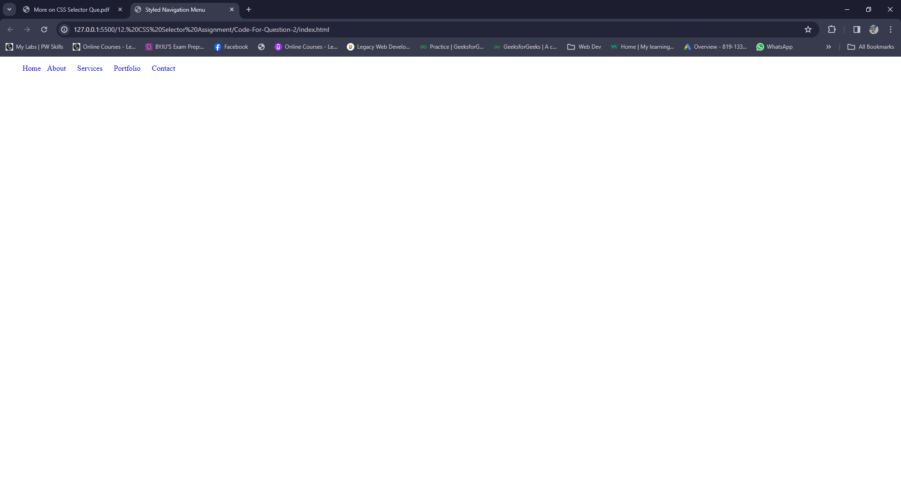

## 1. For the given index.html file. Perform the following task, without changing the index.html file.
A. Create a CSS file to apply styles to the HTML element and link it.

B. Using the combinator selector, perform the following task
- Use any of the CSS combinator selector to target all the anchor tags and change the text color to red
- Target only the first `<h2>` tag and change the text and background color using the combinator selector
- Also, select the first `<p>` tag and change the text color to red.

C. Using the attribute selector, perform the following taks.
- target the anchor tag with attribute "href" and change the text color to red and remove the text underline.
- target the anchor tag with attribute of class name "active", change the text color, and provide the text style properties with underlining.
- Target the anchor tag with attribute of the target whose value is "_self" and change the background color.

D. Using the Pseudo selectors, perform the following task
- Target the last `<p>` tag and add "..." after its value
- Target the list of bullet points and change the color of the bullet points without changing the list item's value.
- Among the Three `<p>` tag, select the first letter of the second `<p>` tag, and change the color to red also increase the font size to 30px.

### index.html
```HTML
<!DOCTYPE html>
<html lang="en">
<head>
    <meta charset="UTF-8">
    <meta name="viewport" content="width=device-width, initial-scale=1.0">
    <title>Test</title>
    <link rel="stylesheet" href="style.css">
</head>
<body>
    <header>
        <nav>
            <h2>TOI</h2>
            <div>
                <h2>Menu</h2>
                <ul>
                    <li><a href="#" target="_blank">Home</a></li>
                    <li><a href="#" class="active" target="_self">About</a></li>
                    <li><a href="#" target="_blank" >Services</a></li>
                    <li><a href="#" target="_blank" >Contact</a></li>
                </ul>
            </div>
            <p>The times of India</p>
            <p>
                Lorem ipsum dolor sit amet, consectetur adipisicing elit. Exercitationem expedita fugiat enim molestiae obcaecati cum ratione quibusdam ipsa, accusantium veritatis.
            </p>
            <p>read article</p>
        </nav>
    </header>
</body>
</html>
```
### style.css
```CSS
/* B-1  */
a{
    color:red;
}
/* B-2  */
nav>h2{
    background-color: gray;
    color:blue;
}
/* B-3  */
div+p{
    color:red;
}
/* C-1 */
a[href]{
    color:red;
    text-decoration: none;
}

/* C-2 */
a[class="active"]{
    color:blue;
    text-decoration: underline;
}

/* C-3 */
a[target="_self"]{
    background-color: gainsboro;
}

/* D-1 */
p:last-child::after{
    content:"..."
}

/* D-2 */
li::marker{
    color:royalblue
}

/* D-3 */
p:nth-of-type(2)::first-letter{
    color:red;
    font-size: 30px;
}
```
### Output:


## 2. Create a CSS file and link it to the provided HTML file below, use any of the combinator class selector to style the navigation menu as follows.
- use the Descendant combinator selector to remove list style type bullet points and text underlining of the menu list items.
- Use the child combinator to display the menu list item inline
- Use the Adjacent sibling combinator selector to apply some margin between the menu list items.

### index.html
```HTML
<!DOCTYPE html>
<html lang="en">
<head>
    <meta charset="UTF-8">
    <meta name="viewport" content="width=device-width, initial-scale=1.0">
    <title>Styled Navigation Menu</title>   
    <link rel="stylesheet" href="style.css">
</head>
<body>
    <header>
        <nav>
            <ul>
                <li><a href="#">Home</a></li>
                <li><a href="#">About</a></li>
                <li><a href="#">Services</a></li>
                <li><a href="#">Portfolio</a></li>
                <li><a href="#">Contact</a></li>
            </ul>
        </nav>
    </header>
    <!-- Your Content Here -->
</body>
</html>
```
### style.css
```CSS
ul li{
    list-style-type: none;
}
li a{
    text-decoration: none;
}
ul li{
    display: inline;
}
li+li{
    margin:10px
}
```
### output:


## 3.Using any of the Pseudo selectors, add any random words after and before the given HTML tag
### index.html
```HTML
<!DOCTYPE html>
<html lang="en">
<head>
    <meta charset="UTF-8">
    <meta name="viewport" content="width=device-width, initial-scale=1.0">
    <title>Document</title>
    <link rel="stylesheet" href="style.css">
</head>
<body>
    <h1>-element-</h1>
</body>
</html>
```
### style.css
```CSS
h1::before{
    content:"Pseudo";
}
h1::after{
    content:"selector";
}
```
### Output:


## 4. Using any of the Pseudo selectors, add any random words after and before the given HTML tag
- An Example should be one HTML button tag
- When hovering the color should be changed and the shadow of the button should be added.
- Proper padding space should be given.
- The cursor style should also be changed to a pointer on hover.

### index.html
```HTML
<!DOCTYPE html>
<html lang="en">
<head>
    <meta charset="UTF-8">
    <meta name="viewport" content="width=device-width, initial-scale=1.0">
    <title>Document</title>
    <link rel="stylesheet" href="style.css">
</head>
<body>
    <button>PW Skills</button>
</body>
</html>
```

### style.css
```CSS
button{
    padding:10px 15px;
    font-size: 1.5rem;
    color:#fff;
    background-color: blue;
    border:none;
    border-radius: 10px;
    cursor: pointer;
    margin: 30px;
}
button:hover{
    background-color: royalblue;
    box-shadow: 10px 5px 5px gray;
}
```

### Output:

### Hover Output:
