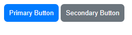
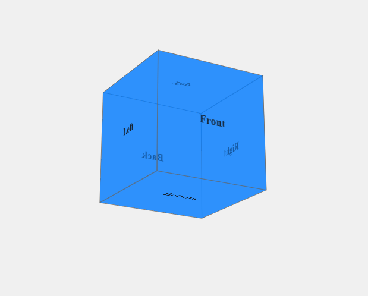
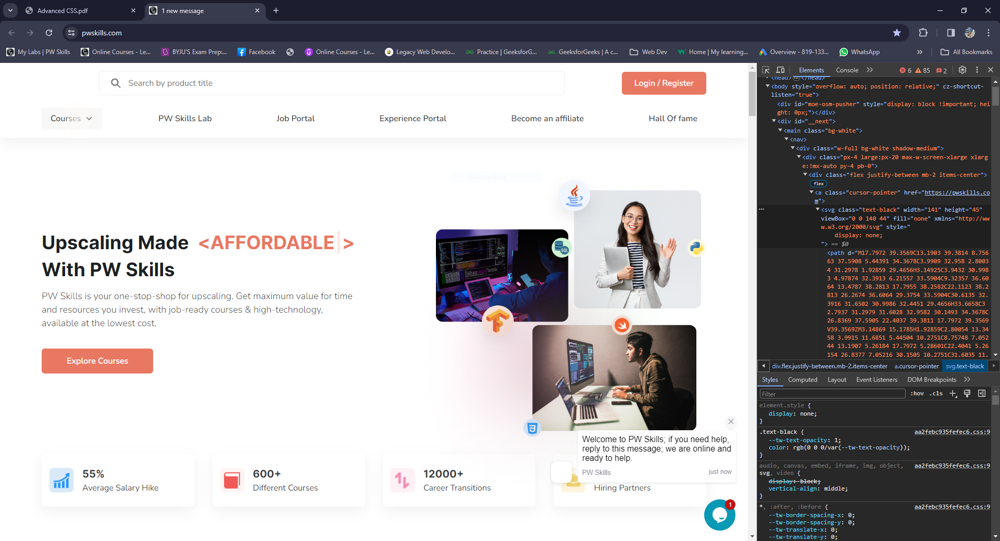
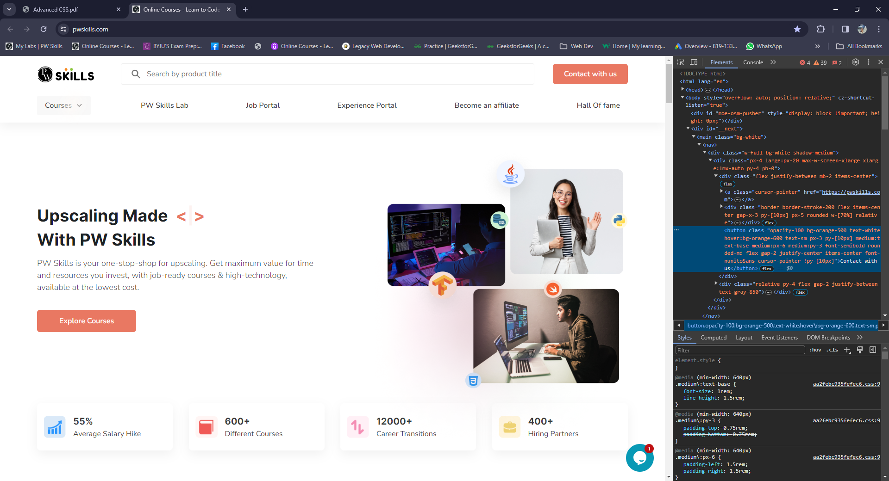

## 1. Explain the purpose of using the var() function in CSS. Also you have created two buttons with id named primaryBtn and secondaryBtn which should be given background colors using the var() function. The color code for primaryColor is #00b7ff and secondaryColor is #6c757d.
### index.html
```HTML
<!DOCTYPE html>
<html lang="en">
<head>
    <meta charset="UTF-8">
    <meta name="viewport" content="width=device-width, initial-scale=1.0">
    <title>Button</title>
    <style>
        :root {
            --primaryColor: #007bff;
            --secondaryColor: #6c757d;
        }
        button{
            color:#fff;
            padding:10px;
            border:none;
            border-radius: 7px;
            cursor: pointer;
        }
        #primaryBtn{
            background-color: var(--primaryColor);
        }
        #secondaryBtn{
            background-color: var(--secondaryColor);
        }
    </style>
</head>
<body>
    <button id="primaryBtn">Primary Button</button>
    <button id="secondaryBtn">Secondary Button</button>
</body>
</html>
```
### output:


## 2. Create a 3D cube using the transform property of CSS.
### index.html
```HTML
<!DOCTYPE html>
<html lang="en">

<head>
    <meta charset="UTF-8">
    <meta name="viewport" content="width=device-width, initial-scale=1.0">
    <title>3D Cube</title>
    <style>
        body {
            display: flex;
            justify-content: center;
            align-items: center;
            min-height: 100vh;
            margin: 0;
            background-color: #f0f0f0;
        }

        .container {
            perspective: 100rem;
        }

        .cube {
            width: 200px;
            height: 200px;
            position: relative;
            transform-style: preserve-3d;
            transform: rotateX(20deg) rotateY(30deg);
        }

        .side {
            position: absolute;
            width: 200px;
            height: 200px;
            background-color: rgba(0, 123, 255, 0.7);
            border: 1px solid #666;
            display: flex;
            justify-content: center;
            align-items: center;
            font-size: 20px;
            font-weight: bold;
            opacity: 0.8;
        }

        .front {
            transform: translateZ(100px);
        }

        .back {
            transform: rotateY(180deg) translateZ(100px);
        }

        .right {
            transform: rotateY(90deg) translateZ(100px);
        }

        .left {
            transform: rotateY(-90deg) translateZ(100px);
        }

        .top {
            transform: rotateX(90deg) translateZ(100px);
        }

        .bottom {
            transform: rotateX(-90deg) translateZ(100px);
        }
    </style>
</head>

<body>
    <div class="container">
        <div class="cube">
            <div class="side front">Front</div>
            <div class="side back">Back</div>
            <div class="side right">Right</div>
            <div class="side left">Left</div>
            <div class="side top">Top</div>
            <div class="side bottom">Bottom</div>
        </div>
    </div>
</body>

</html>
```
### Output:


## 3. Create a simple circular loader which will rotate continuously to look like a loading screen on a website.
### index.html
```HTML
<!DOCTYPE html>
<html lang="en">

<head>
    <meta charset="UTF-8">
    <meta name="viewport" content="width=device-width, initial-scale=1.0">
    <title>Loader</title>
    <style>
        body{
            display: flex;
            min-height: 100vh;
            justify-content: center;
            align-items: center;
            margin:0;
        }
        .loader {
            border: 5px solid rgba(0, 0, 0, 0.1);
            border-left-color: #007bff;
            border-radius: 50%;
            width: 50px;
            height: 50px;
            animation: spin 1s linear infinite;
            margin:10px;
        }
        
        @keyframes spin {
            from {
                transform: rotate(0deg);
            }
            to {
                transform: rotate(360deg);
            }
        }
        

    </style>
</head>

<body>
    <div class="loader"></div>
</body>

</html>
```
### Output:


## 4. You have to visit the PW Skills website (https://pwskills.com/) and have to hide the logo by using the developer tool. This should be done using the CSS and developer tool only, use of javascript is prohibited.

### Output:


## 5. You have to visit the PW Skills web site (https://pwskills.com/) and have to change the content of the Login/Register button to Connect with us using the developer tool. This should be done using the elements of developer tools only, use of javascript is prohibited.

### Output:

