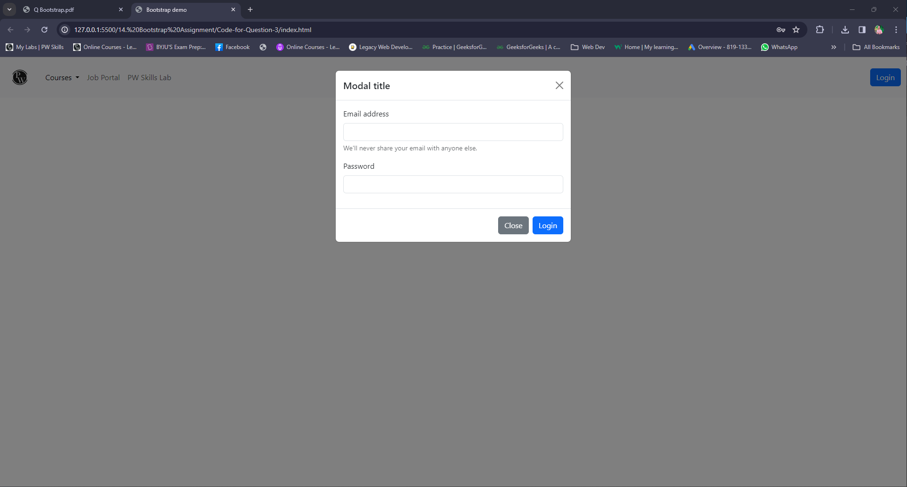

## 1. You have to create a course card which should contain the thumbnail image, title and description with a call to action button.
### index.html
```HTML
<!doctype html>
<html lang="en">

<head>
    <title>Title</title>
    <!-- Required meta tags -->
    <meta charset="utf-8" />
    <meta name="viewport" content="width=device-width, initial-scale=1, shrink-to-fit=no" />

    <!-- Bootstrap CSS v5.2.1 -->
    <link href="https://cdn.jsdelivr.net/npm/bootstrap@5.3.2/dist/css/bootstrap.min.css" rel="stylesheet"
        integrity="sha384-T3c6CoIi6uLrA9TneNEoa7RxnatzjcDSCmG1MXxSR1GAsXEV/Dwwykc2MPK8M2HN" crossorigin="anonymous" />
</head>

<body class="d-flex justify-content-center align-items-center vh-100">
    <div class="card" style="width: 18rem;">
        
        <div class="card-body">
          <h5 class="card-title">Full Stack Web Development</h5>
          <p class="card-text">Learn MERN stack: MongoDB, Express.js, React.js, Node.js. Build
            dynamic web apps. Gain hands-on full-stack skills.</p>
          <a href="#" class="btn btn-primary w-100">Enroll Now</a>
        </div>
      </div>
    <!-- Bootstrap JavaScript Libraries -->
    <script src="https://cdn.jsdelivr.net/npm/@popperjs/core@2.11.8/dist/umd/popper.min.js"
        integrity="sha384-I7E8VVD/ismYTF4hNIPjVp/Zjvgyol6VFvRkX/vR+Vc4jQkC+hVqc2pM8ODewa9r"
        crossorigin="anonymous"></script>

    <script src="https://cdn.jsdelivr.net/npm/bootstrap@5.3.2/dist/js/bootstrap.min.js"
        integrity="sha384-BBtl+eGJRgqQAUMxJ7pMwbEyER4l1g+O15P+16Ep7Q9Q+zqX6gSbd85u4mG4QzX+"
        crossorigin="anonymous"></script>
</body>

</html>
```
### Output:


## 2. In the assignment you have to create a simple carousel consisting of three slides with a controller and indicator on it to make it easy for the user to navigate to other slides easily.
### index.html
```HTML
<!doctype html>
<html lang="en">

<head>
    <title>Carousel</title>
    <!-- Required meta tags -->
    <meta charset="utf-8" />
    <meta name="viewport" content="width=device-width, initial-scale=1, shrink-to-fit=no" />

    <!-- Bootstrap CSS v5.2.1 -->
    <link href="https://cdn.jsdelivr.net/npm/bootstrap@5.3.2/dist/css/bootstrap.min.css" rel="stylesheet"
        integrity="sha384-T3c6CoIi6uLrA9TneNEoa7RxnatzjcDSCmG1MXxSR1GAsXEV/Dwwykc2MPK8M2HN" crossorigin="anonymous" />
</head>

<body class="d-flex justify-content-center align-items-center vh-100">
    <div id="carouselId" class="carousel slide w-75" data-bs-ride="carousel">
        <div class="carousel-indicators">
            <button type="button" data-bs-target="#carouselExampleIndicators" data-bs-slide-to="0" class="active" aria-current="true" aria-label="Slide 1"></button>
            <button type="button" data-bs-target="#carouselExampleIndicators" data-bs-slide-to="1" aria-label="Slide 2"></button>
            <button type="button" data-bs-target="#carouselExampleIndicators" data-bs-slide-to="2" aria-label="Slide 3"></button>
          </div>
        <div class="carousel-inner" role="listbox">
            <div class="carousel-item active">
                
            </div>
            <div class="carousel-item">
                
                
            </div>
            <div class="carousel-item">
                
                
            </div>
        </div>
        <button class="carousel-control-prev" type="button" data-bs-target="#carouselId" data-bs-slide="prev">
            <span class="carousel-control-prev-icon" aria-hidden="true"></span>
            <span class="visually-hidden">Previous</span>
        </button>
        <button class="carousel-control-next" type="button" data-bs-target="#carouselId" data-bs-slide="next">
            <span class="carousel-control-next-icon" aria-hidden="true"></span>
            <span class="visually-hidden">Next</span>
        </button>
    </div>


    

    <!-- Bootstrap JavaScript Libraries -->
    <script src="https://cdn.jsdelivr.net/npm/@popperjs/core@2.11.8/dist/umd/popper.min.js"
        integrity="sha384-I7E8VVD/ismYTF4hNIPjVp/Zjvgyol6VFvRkX/vR+Vc4jQkC+hVqc2pM8ODewa9r"
        crossorigin="anonymous"></script>

    <script src="https://cdn.jsdelivr.net/npm/bootstrap@5.3.2/dist/js/bootstrap.min.js"
        integrity="sha384-BBtl+eGJRgqQAUMxJ7pMwbEyER4l1g+O15P+16Ep7Q9Q+zqX6gSbd85u4mG4QzX+"
        crossorigin="anonymous"></script>
</body>

</html>
```
### Output:


## 3. Create a navigation menu which should consist of the pw logo, simple navigation menu items like courses, job portal etc. and at least there should be a login button, if the user clicks on the login button a modal should open with a form for taking user email and password with a login button in it to submit that form.
### index.html

```HTML
<!doctype html>
<html lang="en">

<head>
    <meta charset="utf-8">
    <meta name="viewport" content="width=device-width, initial-scale=1">
    <title>Bootstrap demo</title>
    <!-- Bootstrap CSS CDN  -->
    <link href="https://cdn.jsdelivr.net/npm/bootstrap@5.3.2/dist/css/bootstrap.min.css" rel="stylesheet"
        integrity="sha384-T3c6CoIi6uLrA9TneNEoa7RxnatzjcDSCmG1MXxSR1GAsXEV/Dwwykc2MPK8M2HN" crossorigin="anonymous">
</head>

<body>


    <nav class="navbar navbar-expand-lg bg-body-tertiary">
        <div class="container-fluid">
            <a class="navbar-brand" href="#"></a>
            <button class="navbar-toggler" type="button" data-bs-toggle="collapse"
                data-bs-target="#navbarSupportedContent" aria-controls="navbarSupportedContent" aria-expanded="false"
                aria-label="Toggle navigation">
                <span class="navbar-toggler-icon"></span>
            </button>
            <div class="collapse navbar-collapse" id="navbarSupportedContent">
                <ul class="navbar-nav me-auto mb-2 mb-lg-0">
                    <li class="nav-item dropdown">
                        <a class="nav-link active dropdown-toggle" href="#" role="button" data-bs-toggle="dropdown"
                            aria-expanded="false">
                            Courses
                        </a>
                        <ul class="dropdown-menu">
                            <li><a class="dropdown-item" href="#">Software Engineering</a></li>
                            <li><a class="dropdown-item" href="#">Artificial Intelligence</a></li>
                            <li><a class="dropdown-item" href="#">Workshop</a></li>
                        </ul>
                    </li>
                    <li class="nav-item">
                        <a class="nav-link" aria-current="page" href="#">Job Portal</a>
                    </li>
                    <li class="nav-item">
                        <a class="nav-link" href="#">PW Skills Lab</a>
                    </li>

                </ul>
                <form class="d-flex" role="search">

                    <button class="btn btn-primary" type="button" data-bs-toggle="modal"
                        data-bs-target="#exampleModal">Login</button>
                </form>
            </div>
        </div>
    </nav>
    <!-- Modal for Login -->
    <div class="modal fade" id="exampleModal" tabindex="-1" aria-labelledby="exampleModalLabel" aria-hidden="true">
        <div class="modal-dialog">
            <div class="modal-content">
                <div class="modal-header">
                    <h1 class="modal-title fs-5" id="exampleModalLabel">Modal title</h1>
                    <button type="button" class="btn-close" data-bs-dismiss="modal" aria-label="Close"></button>
                </div>
                <div class="modal-body">
                    <form>
                        <div class="mb-3">
                            <label for="exampleInputEmail1" class="form-label">Email address</label>
                            <input type="email" class="form-control" id="exampleInputEmail1"
                                aria-describedby="emailHelp">
                            <div id="emailHelp" class="form-text">We'll never share your email with anyone else.</div>
                        </div>
                        <div class="mb-3">
                            <label for="exampleInputPassword1" class="form-label">Password</label>
                            <input type="password" class="form-control" id="exampleInputPassword1">
                        </div>
                        
                    </form>
                </div>
                <div class="modal-footer">
                    <button type="button" class="btn btn-secondary" data-bs-dismiss="modal">Close</button>
                    <button type="button" class="btn btn-primary">Login</button>
                </div>
            </div>
        </div>
    </div>


    <!-- Bootstrap Js CDN  -->
    <script src="https://cdn.jsdelivr.net/npm/bootstrap@5.3.2/dist/js/bootstrap.bundle.min.js"
        integrity="sha384-C6RzsynM9kWDrMNeT87bh95OGNyZPhcTNXj1NW7RuBCsyN/o0jlpcV8Qyq46cDfL"
        crossorigin="anonymous"></script>
</body>

</html>
```

### Output:


### Output-2:



