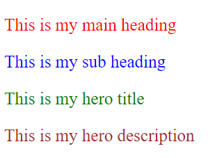
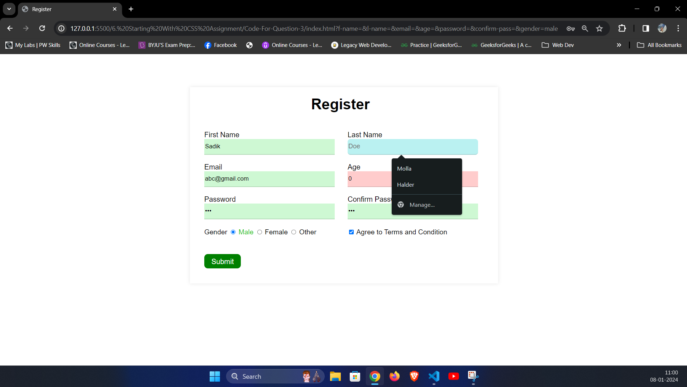

## 1. Create a simple page with some div tags and show different ways to add css as well as what happens when you target the same elements with inline, internal and external CSS. Also utilize comments in the project where required.

### index.html

```HTML
<!DOCTYPE html>
<html lang="en">
<head>
    <meta charset="UTF-8">
    <meta name="viewport" content="width=device-width, initial-scale=1.0">
    <title>Question-1</title>
    <!-- Linking external css from style.css file -->
    <style>
        .internal{
            color:blue;
            font-size: 25px;
        }
        .inline-internal{
            color:blueviolet;
            font-size: 30px;
        }
        .internal-external{
            color:purple;
            font-size: 25px;
        }
        .inline-internal-external{
            color:black;
            font-size: 30px;
        }
        </style>
        <!-- according to order external css applied  -->
        <link rel="stylesheet" href="style.css">
</head>
<body>
    <div style="color: red;font-size: 25px;">Inline CSS</div>
    <div class="internal">Internal CSS</div>
    <div class="external">External CSS</div>
    <div class="inline-internal" style="color:#e94aa9;font-size: 25px;">Inline and Internal CSS applied</div>
    <div class="inline-external" style="color:black;font-size: 25px;">Inline and External CSS applied</div>
    <div class="internal-external">Internal and External CSS applied</div>
    <div class="inline-internal-external" style="color:violet;font-size: 25px;">Inline, internal and external CSS applied</div>
</body>
</html>
```
</div>

### style.css
```CSS
.external{
    color:green;
    font-size: 25px;
}
.inline-external{
    color:brown;
    font-size: 30px;
}

.internal-external{
    color:brown;
    font-size: 30px;
}
.inline-internal-external{
    color:red;
    font-size: 35px;
}
```
### output

___

## 2. Build an HTML page with multiple paragraphs, each assigned a unique class name. Write CSS rules using class selectors to apply distinct styling to each paragraph. Follow the BEM naming convention and explain how you've named the classes.

### index.html
```HTML
<!DOCTYPE html>
<html lang="en">
  <head>
    <meta charset="UTF-8" />
    <meta name="viewport" content="width=device-width, initial-scale=1.0" />
    <link rel="stylesheet" href="style.css">
    <title>Assignment-6</title>
  </head>
  <body>
    <div class="main">
      <p class="main__heading">This is my main heading</p>
      <p class="main__subheading">This is my sub heading</p>
    </div>
    <div class="hero">
      <p class="hero__title">This is my hero title</p>
      <p class="hero__description">This is my hero description</p>
    </div>
  </body>
</html>
```
### style.css
```CSS
*{
    font-size: 25px;
}
.main__heading {
  color: red;
}
.main__subheading {
  color: blue;
}
.hero__title {
  color: green;
}
.hero__description {
  color: brown;
}
```
### Output

___

## 3. Develop an HTML form with various input elements Use CSS to style the form, including setting background color for input fields. Create a custom color palette for the form elements, and demonstrate how to apply opacity to the form sections.

### index.html

<div style="overflow: auto; height: 500px;">

```HTML
 <!DOCTYPE html>
<html lang="en">
  <head>
    <meta charset="UTF-8" />
    <meta name="viewport" content="width=device-width, initial-scale=1.0" />
    <link rel="stylesheet" href="style.css" />
    <title>Register</title>
  </head>
  <body>
    <div class="container">
      <div class="heading">Register</div>
      <form action="#">
        <div class="form-row">
          <div class="inp-data">
            <label for="f-name">First Name</label>
            <input
              type="text"
              name="f-name"
              id="f-name"
              placeholder="John"
              minlength="3"
            />
          </div>
          <div class="inp-data">
            <label for="l-name">Last Name</label>
            <input type="text" name="l-name" id="l-name" placeholder="Doe" />
          </div>
        </div>
        <div class="form-row">
          <div class="inp-data">
            <label for="email">Email</label>
            <input
              type="email"
              name="email"
              id="email"
              placeholder="abc@xyz.com"
            />
          </div>
          <div class="inp-data">
            <label for="age">Age</label>
            <input type="number" name="age" id="age" min="1" placeholder="21" />
          </div>
        </div>
        <div class="form-row">
          <div class="inp-data">
            <label for="password">Password</label>
            <input
              type="password"
              name="password"
              id="password"
              placeholder="Password"
            />
          </div>
          <div class="inp-data">
            <label for="confirm-pass">Confirm Password</label>
            <input
              type="password"
              name="confirm-pass"
              id="confirm-pass"
              placeholder="Confirm Password"
            />
          </div>
        </div>
        <div class="form-row">
          <div class="input-data">
            <label for="gender"
              >Gender
              <input
                type="radio"
                name="gender"
                id="male"
                value="male"
                checked
              />
              <label for="male">Male</label>
              <input type="radio" name="gender" id="female" value="female" />
              <label for="female">Female</label>
              <input type="radio" name="gender" id="other" />
              <label for="other">Other</label>
            </label>
          </div>
          <div class="input-data">
            <input type="checkbox" name="term" id="term">
            <label for="term">Agree to Terms and Condition</label>
          </div>
        </div>
        <div class="form-row">
          <div class="btn">
            <input type="submit" value="Submit" id="submit-btn">
          </div>
        </div>
      </form>
    </div>
  </body>
</html>

```
</div>

### style.css

<div style="overflow: auto; height: 500px;">

```CSS
body {
  display: flex;
  align-items: center;
  justify-content: center;
  min-height: 80vh;
  padding: 10px;
  font-family: "Poppins", sans-serif;
}
.container {
  max-width: 800px;
  background: #fff;
  width: 800px;
  padding: 25px 40px 10px 20px;
  box-shadow: 0px 0px 10px rgba(0, 0, 0, 0.1);
}
.container .heading {
  text-align: center;
  font-size: 41px;
  font-weight: 600;
  font-family: "Poppins", sans-serif;
}

.container form .form-row {
  display: flex;
  margin: 32px 0;
}
form .inp-data {
  width: 100%;
  height: 40px;
  margin: 0 20px;
  position: relative;
  margin-top: 18px;
}

.inp-data input {
  display: block;
  width: 100%;
  height: 100%;
  border: none;
  outline: none;
  font-size: 17px;
  border-bottom: 2px solid rgba(0, 0, 0, 0.12);
}

.inp-data label {
  pointer-events: none;
  bottom: 10px;
  font-size: 20px;
}

.input-data {
  width: 100%;
  height: 40px;
  margin: 0 20px;
  position: relative;
  margin-top: 20px;
  font-size: 1.2rem;
}

.btn input {
  width: 100%;
  height: 40px;
  margin: 0 20px;
  position: relative;
  font-size: 20px;
  border: none;
  background-color: green;
  color:white;
  padding: 10px 0;
  border-radius: 10px;
  cursor: pointer;
}

.input-data label[for="gender"] input:checked + label {
  color: rgb(40, 199, 22);
}

.inp-data input:valid {
  background-color: rgba(17, 220, 41, 0.202);
}
.inp-data input:invalid {
  background-color: rgba(255, 0, 0, 0.2);
}
.inp-data input:placeholder-shown {
  background-color: #fff ;
}
.inp-data input:focus {
  background-color: rgba(27, 208, 208, 0.3);
  border-radius: 8px;
  font-size: 18px;
}


@media (max-width: 700px) {
    .container{
        box-shadow: none;
    }
  .container .text {
    font-size: 30px;
  }
  .container form {
    padding: 10px 0 0 0;
  }
  .container form .form-row {
    display: block;
  }
  form .form-row .inp-data {
    margin: 35px 0 !important;
  }
  form .form-row .input-data {
    margin: 35px 0 !important;
  }
  form .form-row .btn {
    margin: 35px 0 !important;
    text-align: left;
  }
  .btn input {
    margin-left: 0;
    width: 50% !important;
  }
}

```

</div>

### Output
