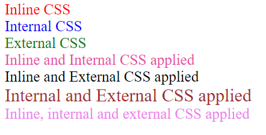

## 1. Create a simple page with some div tags and show different ways to add css as well as what happens when you target the same elements with inline, internal and external CSS. Also utilize comments in the project where required.

### index.html
```HTML
<!DOCTYPE html>
<html lang="en">
<head>
    <meta charset="UTF-8">
    <meta name="viewport" content="width=device-width, initial-scale=1.0">
    <title>Question-1</title>
    <!-- Linking external css from style.css file -->
    <style>
        .internal{
            color:blue;
            font-size: 25px;
        }
        .inline-internal{
            color:blueviolet;
            font-size: 30px;
        }
        .internal-external{
            color:purple;
            font-size: 25px;
        }
        .inline-internal-external{
            color:black;
            font-size: 30px;
        }
        </style>
        <!-- according to order external css applied  -->
        <link rel="stylesheet" href="style.css">
</head>
<body>
    <div style="color: red;font-size: 25px;">Inline CSS</div>
    <div class="internal">Internal CSS</div>
    <div class="external">External CSS</div>
    <div class="inline-internal" style="color:#e94aa9;font-size: 25px;">Inline and Internal CSS applied</div>
    <div class="inline-external" style="color:black;font-size: 25px;">Inline and External CSS applied</div>
    <div class="internal-external">Internal and External CSS applied</div>
    <div class="inline-internal-external" style="color:violet;font-size: 25px;">Inline, internal and external CSS applied</div>
</body>
</html>
```
### style.css
```CSS
.external{
    color:green;
    font-size: 25px;
}
.inline-external{
    color:brown;
    font-size: 30px;
}

.internal-external{
    color:brown;
    font-size: 30px;
}
.inline-internal-external{
    color:red;
    font-size: 35px;
}
```
### output
