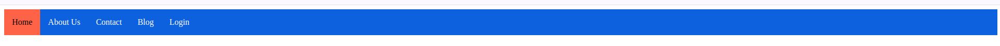
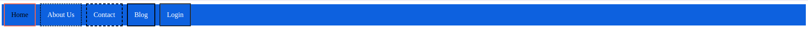
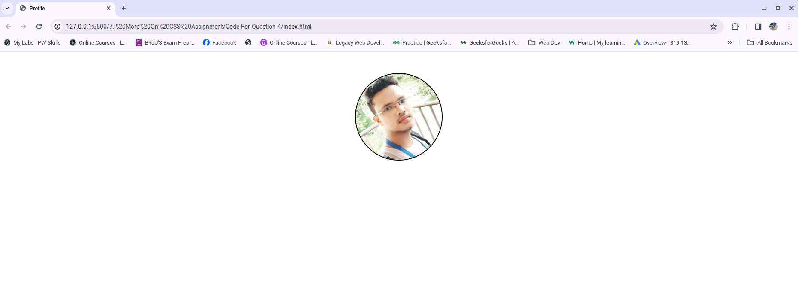
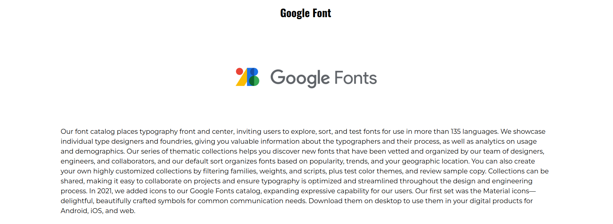
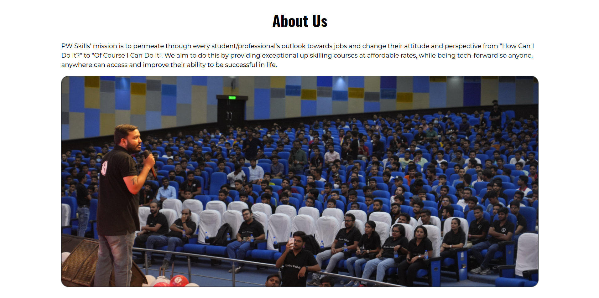
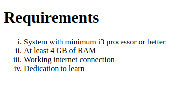

### 1. Create a navigation bar similar to the below-mentioned image. The navigation bar must contain 5 navigation links that are properly placed within the navigation bar using the CSS box model. The navigation items must change their text color on hover.

### index.html
```HTML
<!DOCTYPE html>
<html lang="en">
<head>
    <meta charset="UTF-8">
    <meta name="viewport" content="width=device-width, initial-scale=1.0">
    <title>Document</title>
    <style>

        header{
            background-color: #0d61df;
        }
        nav{
            display: flex;
            justify-content: flex-start;
            align-items: center;
            height: 50px;
            
        }
        nav a{
            color:#fff;
            padding: 0 15px;
            text-decoration: none;
            line-height: 50px;
        }
        nav a:hover{
            color: #fff;
            background-color:gray;
        }
        nav a.active{
            color: #000;
            background-color: tomato;
        }
    </style>
</head>
<body>
    <header>
        <nav>
            <a href="#" class="active">Home</a>
            <a href="#">About Us</a>
            <a href="#">Contact</a>
            <a href="#">Blog</a>
            <a href="#">Login</a>
        </nav>
    </header>
</body>
</html>
```

### Output: 


### 2. Create a div centered with an image and paragraph similar to the image mentioned below.

### index.html

```HTML
<!DOCTYPE html>
<html lang="en">
<head>
    <meta charset="UTF-8">
    <meta name="viewport" content="width=device-width, initial-scale=1.0">
    <title>Card</title>
    <style>
        .card{
            width: 400px;
            background-color: orange;
            box-shadow: 0 0 10px rgba(0,0,0,0.5);
            border-radius: 10px;
            padding: 10px;
            margin: 50px auto;
        }
        .thumbnail{
            width: inherit;
            object-fit: cover;
            border-radius: 15px;
        }
        .desc{
            font-size: 20px;
            font-family: sans-serif;
            color: #000;
            margin: 10px 0;
        }
    </style>
</head>
<body>
    <div class="card">
        
        <p class="desc">
            <b>Course name:</b> PW Skills full stack web development.
        </p>
    </div>
</body>
</html>
```

### Output


### 3.Create a navigation bar similar to question 1. For each navigation item, use a different border style.

### index.html

```HTML
<!DOCTYPE html>
<html lang="en">
<head>
    <meta charset="UTF-8">
    <meta name="viewport" content="width=device-width, initial-scale=1.0">
    <title>Document</title>
    <style>

        header{
            background-color: #0d61df;
        }
        nav{
            display: flex;
            justify-content: flex-start;
            align-items: center;
            height: 50px;
            
        }
        nav a{
            color:#fff;
            padding: 0 15px;
            margin: 0 5px;
            text-decoration: none;
            line-height: 50px;
        }
        nav a:hover{
            color: #fff;
            background-color:gray;
        }
        .link-1{
            color: #000;
            border: 2px solid tomato;
        }
        .link-2{
            border: 2px dotted black;
        }
        .link-3{
            border: 2px dashed black;
        }
        .link-4{
            border: 2px double black;
        }
        .link-5{
            border: 2px groove black;
        }
    </style>
</head>
<body>
    <header>
        <nav>
            <a href="#" class="link-1">Home</a>
            <a href="#" class="link-2">About Us</a>
            <a href="#" class="link-3">Contact</a>
            <a href="#" class="link-4">Blog</a>
            <a href="#" class="link-5">Login</a>
        </nav>
    </header>
</body>
</html>
```

### output:


### 4. Create a simple web page with an image and make the image circular using border-radius.

### index.html

```HTML
<!DOCTYPE html>
<html lang="en">
<head>
    <meta charset="UTF-8">
    <meta name="viewport" content="width=device-width, initial-scale=1.0">
    <title>Profile</title>
    <style>
        .pro-img{
            width: 200px;
            height: 200px;
            border-radius: 50%;
            border: 2px solid #000;
            margin: 50px auto;
            display: block;
        }
    </style>
</head>
<body>
    
</body>
</html>
```
### Output:


### 5. Create a simple blog website about Google Fonts. The webpage must have the heading with "Oswald" font align center to the page, below the heading have an image of Google Fonts and a paragraph about Google fonts in font "Montserrat" paragraph font style should be "montserrat" font.

### index.html

```HTML
<!DOCTYPE html>
<html lang="en">
  <head>
    <meta charset="UTF-8" />
    <meta name="viewport" content="width=device-width, initial-scale=1.0" />
    <title>Font</title>
    <style>
      @import url("https://fonts.googleapis.com/css2?family=Montserrat:ital,wght@0,100..900;1,100..900&family=Oswald:wght@200..700&display=swap");
      h1{
        text-align: center;
        font-family: "Oswald", sans-serif;
        font-size: 3rem;
      }
      img{
        height: 300px;
        margin: 0 auto;
        display: block;
      }
      p{
        font-family: "Montserrat", sans-serif;
        font-size: 20px;
        line-height: 1.5;
        margin: 0 auto;
        width: 80%;
      }
    </style>
  </head>
  <body>
    <h1>Google Font</h1>
    
    <p>
        Our font catalog places typography front and center, inviting users to explore, sort, and test fonts for use in more than 135 languages. We showcase individual type designers and foundries, giving you valuable information about the typographers and their process, as well as analytics on usage and demographics. Our series of thematic collections helps you discover new fonts that have been vetted and organized by our team of designers, engineers, and collaborators, and our default sort organizes fonts based on popularity, trends, and your geographic location. You can also create your own highly customized collections by filtering families, weights, and scripts, plus test color themes, and review sample copy. Collections can be shared, making it easy to collaborate on projects and ensure typography is optimized and streamlined throughout the design and engineering process. In 2021, we added icons to our Google Fonts catalog, expanding expressive capability for our users. Our first set was the Material icons—delightful, beautifully crafted symbols for common communication needs. Download them on desktop to use them in your digital products for Android, iOS, and web. 
    </p>
  </body>
</html>
```

### Output:


### 6. Create a simple website as mentioned in the below image. You can get the assets by visiting https://pwskills.com/about-us

### index.html

```HTML
<!DOCTYPE html>
<html lang="en">
<head>
    <meta charset="UTF-8">
    <meta name="viewport" content="width=device-width, initial-scale=1.0">
    <title>About Us</title>
    <style>
        @import url("https://fonts.googleapis.com/css2?family=Montserrat:ital,wght@0,100..900;1,100..900&family=Oswald:wght@200..700&display=swap");
        h1{
          text-align: center;
          font-family: "Oswald", sans-serif;
          font-size: 3rem;
        }
        img{
          height: 300px;
          margin: 0 auto;
          display: block;
        }
        p{
          font-family: "Montserrat", sans-serif;
          font-size: 20px;
          line-height: 1.5;
          margin: 0 auto;
          width: 80%;
        }
        img{
            margin: 20px auto;
            width: 80%;
            height: 100%;
        }
      </style>
</head>
<body>
    <h1>About Us</h1>
    <p>
        PW Skills' mission is to permeate through every student/professional's outlook towards jobs and change their attitude and perspective from "How Can I Do It?" to "Of Course I Can Do It". We aim to do this by providing exceptional up skilling courses at affordable rates, while being tech-forward so anyone, anywhere can access and improve their ability to be successful in life.
    </p>
    
</body>
</html>
```

### Output:


### 7. Create a simple webpage with a card similar to question number 2. The card must be semi-transparent as default and on hovering the card must be displayed clearly. Use CSS opacity to achieve this output.

### index.html

```HTML
<!DOCTYPE html>
<html lang="en">
<head>
    <meta charset="UTF-8">
    <meta name="viewport" content="width=device-width, initial-scale=1.0">
    <title>Card</title>
    <style>
        .card{
            width: 400px;
            background-color: #f8c42e;
            box-shadow: 0 0 10px rgba(0,0,0,0.5);
            border-radius: 10px;
            padding: 10px;
            margin: 50px auto;
            opacity: 0.5;
            transition: all 0.5s ease-in-out;
        }
        .thumbnail{
            width: inherit;
            object-fit: cover;
            border-radius: 15px;
        }
        .desc{
            font-size: 20px;
            font-family: sans-serif;
            color: #000;
            margin: 10px 0;
        }
        .card:hover{
            opacity: 1;
        }
    </style>
</head>
<body>
    <div class="card">
        
        <p class="desc">
            <b>Course name:</b> PW Skills full stack web development.
        </p>
    </div>
</body>
</html>
```

### Output:
#### Without Hover

#### With Hover


### 8. Create a simple list of items as mentioned in the below image.

### index.html
```HTML
<!DOCTYPE html>
<html lang="en">
<head>
    <meta charset="UTF-8">
    <meta name="viewport" content="width=device-width, initial-scale=1.0">
    <title>Requirements</title>
    <style>
        ol{
            list-style-type: lower-roman;
        }
    </style>
</head>
<body>
    <h1>Requirements</h1>
    <ol>
        <li>System with minimum i3 processor or better</li>
        <li>At least 4 GB of RAM</li>
        <li>Working internet connection</li>
        <li>Dedication to learn</li>
    </ol>
</body>
</html>
```
### Output:
