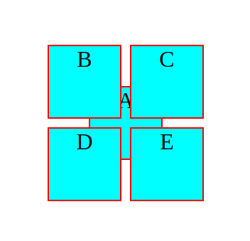
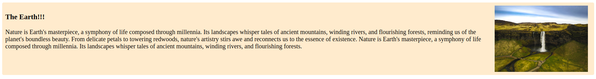
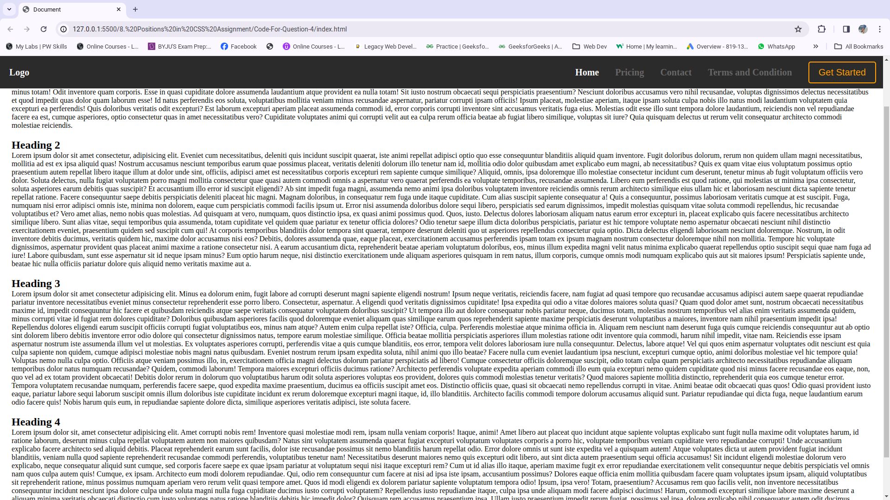

### 1. Write code to position 5 equal-sized(50x50px) boxes A, B, C, D and E as follows,
1. box A 200px from left, and 200px from the top of the viewport.
2. box B -30px left, and -30px above from the center of box A.
3. box C -30px right, and -30px above from the center of box A.
4. box D -30px left, and -30px below from the center of box A.
5. box E -30px right, and -30px below from the center of box A.

### index.html
```HTML
<!DOCTYPE html>
<html lang="en">
<head>
    <meta charset="UTF-8">
    <meta name="viewport" content="width=device-width, initial-scale=1.0">
    <title>Document</title>
    <style>
        .box{
            height: 50px;
            width: 50px;
            background-color: aqua;
            border: 1px solid red;
            text-align: center;
        }
        .box-a{
            position:relative;
            top:200px;
            left: 200px;
        }
        .box-b{
            position:absolute;
            top: -30px;
            left: -30px;
        }
        .box-c{
            position:absolute;
            right: -30px;
            top: -30px;
        }
        .box-d{
            position:absolute;
            bottom: -30px;
            left: -30px;
        }
        .box-e{
            position:absolute;
            bottom: -30px;
            right: -30px;
        }
    </style>
</head>
<body>
    <div class="box-a box">A
        <div class="box-b box">B</div>
        <div class="box-c box">C</div>
        <div class="box-d box">D</div>
        <div class="box-e box">E</div>
    </div>
</body>
</html>
```

### Output:


### 2. Explain the difference between absolute and relative positioning.

|Absolute|Relative|
|:------|:------|
|syntax {position:absolute}| syntax {position:relative}|
|When an element is set to absolute positioning, it is positioned relative to its closest positioned (not static) ancestor element.| When an element is set to relative positioning, it is positioned relative to its normal position in the document flow.|
|Taken out of the normal document flow. Other elements on the page are not affected by its positioning.|Retains its space in the normal document flow. Other elements are positioned as if the relative positioned element still occupies its original space.|
|Does not reserve space for the element in the normal flow. It can overlap with other elements.|The layout is affected as the element is shifted from its original position.|
|Provides precise control over the exact placement of an element.|Provides a way to make minor adjustments to the position of an element without taking it completely out of the document flow.|


### 3. Create a card as shown in the picture below. (You can use CSS float property only for layout).

### index.html
```HTML
<!DOCTYPE html>
<html lang="en">
  <head>
    <meta charset="UTF-8" />
    <meta name="viewport" content="width=device-width, initial-scale=1.0" />
    <title>Card</title>
    <style>
      .card {
        background-color: blanchedalmond;
        padding: 10px;
        border-radius: 5px;
        overflow:hidden;
      }
      .card-desc{
        font-size: 20px;
      }
      .card-img {
        width: 300px;
        float: right;
        padding: 0 10px;
      }
    </style>
  </head>
  <body>
    <div class="card">
      
      <div class="card-desc">
        <h3>The Earth!!!</h3>
        <p>
          Nature is Earth's masterpiece, a symphony of life composed through
          millennia. Its landscapes whisper tales of ancient mountains, winding
          rivers, and flourishing forests, reminding us of the planet's
          boundless beauty. From delicate petals to towering redwoods, nature's
          artistry stirs awe and reconnects us to the essence of existence.
          Nature is Earth's masterpiece, a symphony of life composed through
          millennia. Its landscapes whisper tales of ancient mountains, winding
          rivers, and flourishing forests.
        </p>
      </div>
    </div>
  </body>
</html>
```
### Output:


### 4. Create a simple header that sticks to the top of a webpage upon scrolling.

### index.html
```HTML
<!DOCTYPE html>
<html lang="en">
<head>
    <meta charset="UTF-8">
    <meta name="viewport" content="width=device-width, initial-scale=1.0">
    <title>Document</title>
    <style>
        *{
            margin:0;
            padding:0;
        }
        .header{
            position: sticky;
            top: 0px;
            background-color: #2b2b2b;
            height: 70px;
        }
        .logo{
            position: absolute;
            margin: auto 0px;
            top:0px;
            bottom: 0px;
            left: 20px;
            height: fit-content;
            color:white;
            font-size: 20px;
            font-weight: bold;
        }
        .nav{
            position: absolute;
            margin: auto 0px;
            top:0px;
            bottom: 0px;
            right: 0px;
            height: fit-content;
            font-size: 20px;
            font-weight: bold;
        }
        .nav a{
            text-decoration: none;
            color: #686666;
            margin: 0px 15px;
        }
        .nav-btn{
            margin: auto 15px;
            top:0px;
            bottom: 0px;
            right: 20px;
            height: fit-content;
            font-size: 20px;
            background: transparent;
            color: #ff9f05;
            border: 2px solid #ff9f05;
            padding: 10px 20px;
            border-radius: 5px;
            cursor: pointer;
        }
        nav .active{
            color: #fff;
        }
        main{
            padding:0 25px;
        }
        section{
            margin-top: 20px;
        }
    </style>
</head>
<body>
    <header class="header">
        <div class="logo">Logo</div>
        <nav class="nav">
            <a href="#" class="active">Home</a>
            <a href="#">Pricing</a>
            <a href="#">Contact</a>
            <a href="#">Terms and Condition</a>
            <button class="nav-btn">Get Started</button>
        </nav>
    </header>
    <main>
        <section>
            <h2>Heading 1</h2>
            <p>Lorem ipsum dolor sit amet consectetur adipisicing elit. Temporibus, aliquam exercitationem. Nam omnis quos reprehenderit nemo aperiam doloremque accusamus assumenda maiores, inventore ipsum architecto, tempora, exercitationem quibusdam! Porro impedit odit, explicabo voluptas et blanditiis molestias vero libero doloribus. Ipsum quo omnis soluta placeat possimus unde odit ad quibusdam repellat perferendis aliquam veniam, sunt officiis ipsam dolorum, quaerat excepturi, saepe a molestiae sapiente alias quas dolorem magnam! Ex laborum earum saepe repellat? Repellendus corrupti praesentium iste cum. Voluptatum culpa consectetur delectus. Facere quod minima fugiat rem saepe iusto amet distinctio dolore aliquid aliquam! Distinctio voluptas ex laudantium reiciendis fugit a ipsam velit dicta quia, quasi, sapiente facilis, aliquam modi. Magnam hic facere ea architecto. Maiores non voluptate eos fuga nam harum quibusdam velit mollitia cum perferendis vitae, ratione, illum temporibus nihil dolorum, necessitatibus et. Veniam molestias, tempore suscipit modi, veritatis reprehenderit quam delectus ipsa cum amet, placeat esse! Vitae, minus totam! Odit inventore quam corporis. Esse in quasi cupiditate dolore assumenda laudantium atque provident ea nulla totam! Sit iusto nostrum obcaecati sequi perspiciatis praesentium? Nesciunt doloribus accusamus vero nihil recusandae, voluptas dignissimos delectus necessitatibus et quod impedit quas dolor quam laborum esse! Id natus perferendis eos soluta, voluptatibus mollitia veniam minus recusandae aspernatur, pariatur corrupti ipsam officiis! Ipsum placeat, molestiae aperiam, itaque ipsam soluta culpa nobis illo natus modi laudantium voluptatem quia excepturi ea perferendis! Quis doloribus veritatis odit excepturi? Est laborum excepturi aperiam placeat assumenda commodi id, error corporis corrupti inventore sint accusamus veritatis fuga eius. Molestias odit esse illo sunt tempora dolore laudantium, reiciendis non vel repudiandae facere ea est, cumque asperiores, optio consectetur quas in amet necessitatibus vero? Cupiditate voluptates animi qui corrupti velit aut ea culpa rerum officia beatae ab fugiat libero similique, voluptas sit iure? Quia quisquam delectus ut rerum velit consequatur architecto commodi molestiae reiciendis.</p>
        </section>
        <section>
            <h2>Heading 2</h2>
            <p>Lorem ipsum dolor sit amet consectetur, adipisicing elit. Eveniet cum necessitatibus, deleniti quis incidunt suscipit quaerat, iste animi repellat adipisci optio quo esse consequuntur blanditiis aliquid quam inventore. Fugit doloribus dolorum, rerum non quidem ullam magni necessitatibus, mollitia ad est ex ipsa aliquid quas! Nostrum accusamus nesciunt temporibus earum quae possimus placeat, veritatis deleniti dolorum illo tenetur nam id, mollitia odio dolor quibusdam amet explicabo eum magni, ab necessitatibus? Quis ex quam vitae eius voluptatum possimus optio praesentium autem repellat libero itaque illum at dolor unde sint, officiis, adipisci amet est necessitatibus corporis excepturi rem sapiente cumque similique? Aliquid, omnis, ipsa doloremque illo molestiae consectetur incidunt cum deserunt, tenetur minus ab fugit voluptatum officiis vero dolor. Soluta delectus, nulla fugiat voluptatem porro magni mollitia consectetur quae quasi autem commodi omnis a aspernatur vero quaerat perferendis ea voluptate temporibus, recusandae assumenda. Libero eum perferendis est quod ratione, qui molestias ut minima ipsa consectetur, soluta asperiores earum debitis quas suscipit? Et accusantium illo error id suscipit eligendi? Ab sint impedit fuga magni, assumenda nemo animi ipsa doloribus voluptatem inventore reiciendis omnis rerum architecto similique eius ullam hic et laboriosam nesciunt dicta sapiente tenetur repellat ratione. Facere consequuntur saepe debitis perspiciatis deleniti placeat hic magni. Magnam doloribus, in consequatur rem fuga unde itaque cupiditate. Cum alias suscipit sapiente consequatur a! Quis a consequuntur, possimus laboriosam veritatis cumque at est suscipit. Fuga, numquam nisi error adipisci omnis iste, minima non dolorem, eaque cum perspiciatis commodi facilis ipsum ut. Error nisi assumenda doloribus dolore sequi libero, perspiciatis sed earum dignissimos, impedit molestias quisquam vitae soluta commodi repellendus, hic recusandae voluptatibus et? Vero amet alias, nemo nobis quas molestias. Ad quisquam at vero, numquam, quos distinctio ipsa, ex quasi animi possimus quod. Quos, iusto. Delectus dolores laboriosam aliquam natus earum error excepturi in, placeat explicabo quis facere necessitatibus architecto similique libero. Sunt alias vitae, sequi temporibus quia assumenda, totam cupiditate vel quidem quae pariatur ex tenetur officia dolores? Odio tenetur saepe illum dicta doloribus perspiciatis, pariatur est hic tempore voluptate nemo aspernatur obcaecati nesciunt nihil distinctio exercitationem eveniet, praesentium quidem sed suscipit cum qui! At corporis temporibus blanditiis dolor tempora sint quaerat, tempore deserunt deleniti quo ut asperiores repellendus consectetur quia optio. Dicta delectus eligendi laboriosam nesciunt doloremque. Nostrum, in odit inventore debitis ducimus, veritatis quidem hic, maxime dolor accusamus nisi eos? Debitis, dolores assumenda quae, eaque placeat, exercitationem accusamus perferendis ipsam totam ex ipsum magnam nostrum consectetur doloremque nihil non mollitia. Tempore hic voluptate dignissimos, aspernatur provident quas placeat animi maxime a ratione consectetur nisi. A earum accusantium dicta, reprehenderit beatae aperiam voluptatum doloribus, eos, minus illum expedita magni velit natus minima explicabo quaerat repellendus optio suscipit sequi quae nam fuga ad iure! Labore quibusdam, sunt esse aspernatur sit id neque ipsam minus? Eum optio harum neque, nisi distinctio exercitationem unde aliquam asperiores quisquam in rem natus, illum corporis, cumque omnis modi numquam explicabo quis aut sit maiores ipsum! Perspiciatis sapiente unde, beatae hic nulla officiis pariatur dolore quis aliquid nemo veritatis maxime aut a.</p>
        </section>
        <section>
            <h2>Heading 3</h2>
            <p>Lorem ipsum dolor sit amet consectetur adipisicing elit. Minus ea dolorum enim, fugit labore ad corrupti deserunt magni sapiente eligendi nostrum! Ipsum neque veritatis, reiciendis facere, nam fugiat ad quasi tempore quo recusandae accusamus adipisci autem saepe quaerat repudiandae pariatur inventore necessitatibus eveniet minus consectetur reprehenderit esse porro libero. Consectetur, aspernatur. A eligendi quod veritatis dignissimos cupiditate! Ipsa expedita qui odio a vitae dolores maiores soluta quasi? Quam quod dolor amet sunt, nostrum obcaecati necessitatibus maxime id, impedit consequuntur hic facere et quibusdam reiciendis atque saepe veritatis consequatur voluptatem doloribus suscipit? Ut tempora illo aut dolore consequatur nobis pariatur neque, ducimus totam, molestias nostrum temporibus vel alias enim veritatis assumenda quidem, minus corrupti vitae id fugiat rem dolores cupiditate? Doloribus quibusdam asperiores facilis quod doloremque eveniet aliquam quas similique earum quos reprehenderit sapiente maxime perspiciatis deserunt voluptatibus a maiores, inventore nam nihil praesentium impedit ipsa! Repellendus dolores eligendi earum suscipit officiis corrupti fugiat voluptatibus eos, minus nam atque? Autem enim culpa repellat iste? Officia, culpa. Perferendis molestiae atque minima officia in. Aliquam rem nesciunt nam deserunt fuga quis cumque reiciendis consequuntur aut ab optio sint dolorem libero debitis inventore error odio dolore qui consectetur dignissimos natus, tempore earum molestiae similique. Officia beatae mollitia perspiciatis asperiores illum molestias ratione odit inventore quia commodi, harum nihil impedit, vitae nam. Reiciendis esse ipsam aspernatur nostrum iste assumenda illum vel ut molestias. Ex voluptates asperiores corrupti, perferendis vitae a quis cumque blanditiis, eos error, tempora velit dolores laboriosam iure nulla consequuntur. Delectus, labore atque! Vel qui quos enim aspernatur voluptates odit nesciunt est quia culpa sapiente non quidem, cumque adipisci molestiae nobis magni natus quibusdam. Eveniet nostrum rerum ipsam expedita soluta, nihil animi quo illo beatae? Facere nulla cum eveniet laudantium ipsa nesciunt, excepturi cumque optio, animi doloribus molestiae vel hic tempore quia! Voluptas nemo nulla culpa optio. Officiis atque veniam possimus illo, in, exercitationem officia magni delectus dolorum pariatur perspiciatis ad libero! Cumque consectetur officiis doloremque suscipit, odio totam culpa quam perspiciatis architecto necessitatibus repudiandae aliquam temporibus dolor natus numquam recusandae? Quidem, commodi laborum! Tempora maiores excepturi officiis ducimus ratione? Architecto perferendis voluptate expedita aperiam commodi illo eum quia excepturi nemo quidem cupiditate quod nisi minus facere recusandae eos eaque, non, quo vel ad ex totam provident obcaecati! Debitis dolor rerum in dolorum quo voluptatibus harum odit soluta asperiores voluptas eos provident, dolores quis commodi molestias tenetur veritatis? Quod maiores sapiente mollitia distinctio, reprehenderit quia eos cumque tenetur error. Tempora voluptatem recusandae numquam, perferendis facere saepe, quod expedita maxime praesentium, ducimus ea officiis suscipit amet eos. Distinctio officiis quae, quasi sit obcaecati nemo repellendus corrupti in vitae. Animi beatae odit obcaecati quas quos! Odio quasi provident iusto eaque, pariatur labore sequi laborum suscipit omnis illum doloribus iste cupiditate incidunt ex rerum doloremque excepturi magni itaque, id, illo blanditiis. Architecto facilis commodi tempore dolorum accusamus aliquid sunt. Pariatur repudiandae qui dicta fuga, neque laudantium earum odio facere quis! Nobis harum quis eum, in repudiandae sapiente dolore dicta, similique asperiores veritatis adipisci, iste soluta facere.</p>
        </section>
        <section>
            <h2>Heading 4</h2>
            <p>Lorem ipsum dolor sit, amet consectetur adipisicing elit. Amet corrupti nobis rem! Inventore quasi molestiae modi rem, ipsam nulla veniam corporis! Itaque, animi! Amet libero aut placeat quo incidunt atque sapiente voluptas explicabo sunt fugit nulla maxime odit voluptates harum, id ratione laborum, deserunt minus culpa repellat voluptatem autem non maiores quibusdam? Natus sint voluptatem assumenda quaerat fugiat excepturi voluptatum voluptates corporis a porro hic, voluptate temporibus veniam cupiditate vero repudiandae corrupti! Unde accusantium explicabo facere architecto sed aliquid debitis. Placeat reprehenderit earum sunt facilis, dolor iste recusandae possimus sit nemo blanditiis harum repellat odio. Error dolore omnis ut sunt iste expedita vel a quisquam autem! Atque voluptates dicta ut autem provident fugiat incidunt blanditiis, veniam nulla quod sapiente reprehenderit recusandae commodi perferendis, voluptatibus tenetur nam! Necessitatibus deserunt maiores nemo quis excepturi odit libero, aut sint dicta autem praesentium sequi officia accusamus! Sit incidunt eligendi molestiae dolorum vero explicabo, neque consequatur aliquid sunt cumque, sed corporis facere saepe ex quae ipsam pariatur at voluptatum sequi nisi itaque excepturi rem? Cum ut id alias illo itaque, aperiam maxime fugit ex error repudiandae exercitationem velit consequuntur neque debitis perspiciatis vel omnis nam quos culpa autem quis! Cumque, ex ipsam. Architecto eum modi dolorem repudiandae. Qui, odio rem consequuntur cum facere at nisi ad ipsa iste ipsam, accusantium possimus? Dolores eaque officia enim mollitia quibusdam facere quam voluptates ipsum ipsam, aliquid voluptatibus sit reprehenderit ratione, minus possimus numquam aperiam vero rerum velit quasi tempore amet. Quos id modi eligendi ex dolorem pariatur sapiente voluptatum tempora odio! Ipsum, ipsa vero! Totam, praesentium? Accusamus rem quo facilis velit, non inventore necessitatibus consequuntur incidunt nesciunt ipsa dolore culpa unde soluta magni nulla fuga cupiditate ducimus iusto corrupti voluptatem? Repellendus iusto repudiandae itaque, culpa ipsa unde aliquam modi facere adipisci ducimus! Harum, commodi excepturi similique labore maxime deserunt a aliquam minima veritatis obcaecati distinctio cum iusto voluptates natus ratione blanditiis debitis hic impedit dolor? Quisquam rem accusamus praesentium ipsa. Ullam iusto praesentium impedit rerum fugiat, possimus vel ipsa, dolore explicabo nihil consequatur autem odit ducimus. Mollitia commodi saepe accusamus sequi provident perferendis! Iure cumque beatae quos sequi architecto, aut delectus possimus laudantium adipisci dicta quam vel laborum error fugiat rerum sapiente perferendis odio dolor voluptatem nihil quisquam neque totam? Pariatur odio minima, eos corrupti perspiciatis repellendus quasi rem unde consequuntur. Magnam porro doloribus sunt nihil voluptas, dolore, architecto odit quae deserunt in veritatis! Sed aperiam sint harum doloremque quidem dolor? Ratione quidem velit autem, rem eum non necessitatibus ea alias eius quo voluptate illum in cumque pariatur, vel labore quas, sequi exercitationem placeat! Alias, architecto quibusdam error impedit quod aliquid. Incidunt rerum culpa optio enim, at, iure, maxime a sit voluptatum itaque sunt officiis dolores alias quas vitae cumque! Facilis, eius ab laudantium iste cupiditate totam neque ea rerum placeat. Eius, architecto commodi fuga quae, doloribus non porro obcaecati quis molestias illo consequuntur aliquam eum tempora natus pariatur? Modi rerum eius odio voluptatum id veniam non facere delectus veritatis ab impedit quidem ex eveniet consectetur, fuga amet.</p>
        </section>
    </main>
</body>
</html>
```

### Output:



### 5. Explain the Z-index with a code example.
>z-index is a CSS property that controls the stacking order of positioned elements. Elements with a higher z-index value will appear in front of elements with lower values. If two elements have the same z-index, the one that comes later in the HTML or appears later in the document order will be on top.
```HTML
<!DOCTYPE html>
<html lang="en">
<head>
  <meta charset="UTF-8">
  <meta name="viewport" content="width=device-width, initial-scale=1.0">
  <style>
    .box {
      width: 100px;
      height: 100px;
      position: absolute;
    }

    #box1 {
      background-color: red;
      top: 20px;
      left: 20px;
      z-index: 2;
    }

    #box2 {
      background-color: blue;
      top: 40px;
      left: 40px;
      z-index: 1;
    }

    #box3 {
      background-color: green;
      top: 60px;
      left: 60px;
    }
  </style>
</head>
<body>

<div id="box1" class="box"></div>
<div id="box2" class="box"></div>
<div id="box3" class="box"></div>

</body>
</html>

```
- box1 is a red box with a z-index of 2.
- box2 is a blue box with a z-index of 1.
- box3 is a green box with no explicit z-index, so it will be behind box1 and box2 since they have higher stacking order values.
- box1 will be on top, followed by box2, and then box3 at the bottom.