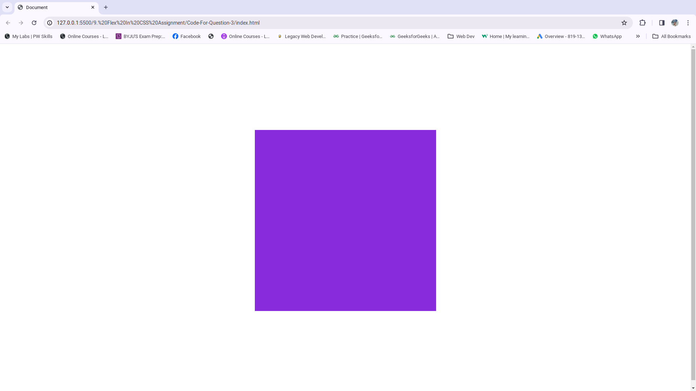
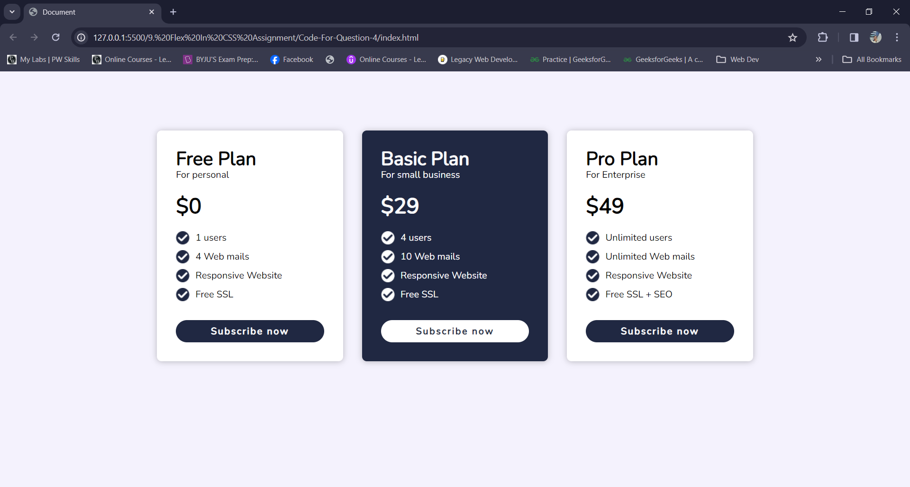
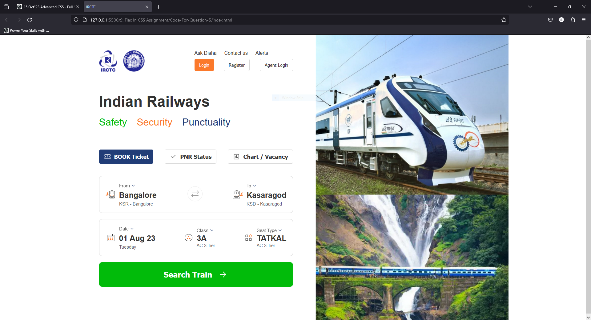

## 1. Describe the main difference between the CSS Flexbox layout model and the CSS Grid layout model. When would you choose to use one over the other.
**Answer:** The Key difference between the flexbox and grid layout model lies in their layout strategies and how they handle the arrangement of elements.

**FlexBox:** Flexbox is primarily designed for one-dimensional layouts, focusing on distributing space and aligning items along a single axis. It's best suited  for layouts where we have a row or column of items, such as navigation menus, card-based design or centering content within a container.

**Grid:** Grid is designed for two-dimensional layouts, allowing us to define both rows and columns. It creates a grid of cells where content can be placed in any cell or span across multiple cells. CSS grid is ideal for complex grid based design like magazine layouts, forms and any layout where content needs to be placed in a precise grid structure.

**Choosing between Flexbox and Grid**
--
**FlexBox:** One might choose Flexbox when you need to arrange items along a single axis, for example, when creating navigation bars, header,footer layout, or aligning elements within a container. Flexbox is nice choice for responsive design where items can vary in size.

**Grid:** One might choose Grid when you need create more complex, two  dimensional layouts with rows and columns. It's particularly useful when you have a grid like structure, such as galleries, forms with multiple fields, or any design that requires precise control over both rows and columns.

## 2. Explain the role of the following key properties in the flexbox layout model
### 1. justify-content
### 2. align-content
### 3. gap
### 4. flex-direction
### 5. flex-wrap

### Answer:
   **1. justify-content:**
   The justify-content property in flexbox is used to control the alignment of flex items along the main axis of the flex container. It determines how the extra space or insufficient space along the main axis is distributed. There are several values for justify-content including flex-start, flex-end, and center, space-between, space-evenly, space-around.

   **2. align-content:** 
   The align-items property controls the alignment of flex items along the cross axis of the flex container.It specifies how items are positioned within their container along this axis. It accepts values such as flex-start, flex-end, center,baseline and stretch.

   **3.gap:**
   The gap property is used to define the space between flex items in both directions, both along the main axis and the cross axis. It's often applied to the flex container itself. It simplifies spacing and creates consistent gaps between items without needing to apply margins to individual items.

   **4. flex-direction:**
   The flex-direction property determines the direction in which flex items are placed within the flex container. It defines the main axis and, consequently, the layout flow. IT can have values such as row, row-reverse, column, or column-reverse.

   **5. flex-wrap:**
   The flex-wrap property controls whether flex items are allowed to wrap onto multiple lines within the flex container when they don't fit along the main axis. It accepts values like nowrap, wrap, and wrap-reverse.

## 3. Write the code to center a div using CSS Flexbox.
### index.html
```HTML
<!DOCTYPE html>
<html lang="en">
<head>
    <meta charset="UTF-8">
    <meta name="viewport" content="width=device-width, initial-scale=1.0">
    <title>Document</title>
    <style>
        body{
            height: 100vh;
            display:flex;
            justify-content: center;
            align-items: center;
        }
        .container{
            width: 500px;
            height: 500px;
            background-color:blueviolet;
        }
    </style>
</head>
<body>
    <div class="container"></div>
</body>
</html>
```

### Output:


## 4. A client of yours wants to add pricing sections on their website to showcase their newly introduced premium plans.
### index.html
```HTML
<!DOCTYPE html>
<html lang="en">
<head>
    <meta charset="UTF-8">
    <meta name="viewport" content="width=device-width, initial-scale=1.0">
    <title>Document</title>
    <link rel="stylesheet" href="style.css">
</head>
<body>
    <section class="pricing">
        <div class="card">
            <h2>Free Plan</h2>
            <p>For personal</p>
            <h3>$0</h3>
            <div class="plan">
                <div class="desc">
                    
                    <p>1 users</p>
                </div>
                <div class="desc">
                    
                    <p>4 Web mails</p>
                </div>
                <div class="desc">
                    
                    <p>Responsive Website</p>
                </div>
                <div class="desc">
                    
                    <p>Free SSL</p>
                </div>
            </div>
            <button class="subs-btn">Subscribe now</button>
        </div>
        <div class="card-2 card">
            <h2>Basic Plan</h2>
            <p>For small business</p>
            <h3>$29</h3>
            <div class="plan">
                <div class="desc">
                    
                    <p>4 users</p>
                </div>
                <div class="desc">
                    
                    <p>10 Web mails</p>
                </div>
                <div class="desc">
                    
                    <p>Responsive Website</p>
                </div>
                <div class="desc">
                    
                    <p>Free SSL</p>
                </div>
            </div>
            <button class="subs-btn btn-light">Subscribe now</button>
        </div>
        <div class="card">
            <h2>Pro Plan</h2>
            <p>For Enterprise</p>
            <h3>$49</h3>
            <div class="plan">
                <div class="desc">
                    
                    <p>Unlimited users</p>
                </div>
                <div class="desc">
                    
                    <p>Unlimited Web mails</p>
                </div>
                <div class="desc">
                    
                    <p>Responsive Website</p>
                </div>
                <div class="desc">
                    
                    <p>Free SSL + SEO</p>
                </div>
            </div>
            <button class="subs-btn">Subscribe now</button>
        </div>
        
    </section>
</body>
</html>
```

### style.css
```CSS
@import url("https://fonts.googleapis.com/css2?family=Nunito&display=swap");

* {
  margin: 0;
  padding: 0;
  font-family: 'Nunito', sans-serif;
}
.pricing{
    min-height: 100vh;
    display: flex;
    justify-content: center;
    background-color: #f4f2fd;
    box-sizing: border-box;
    padding-top: 100px;
    gap:32px;
}
.card{
    width: 250px;
    height: fit-content;
    display: flex;
    flex-direction: column;
    border-radius: 8px;
    background-color: #fff;
    box-shadow: 0px 1px 10px 0px rgba(0,0,0,0.25);
    padding: 32px;
    transition: all 0.3s ease;
}
.card h2{
    font-size: 32px;
    font-weight: 700;
    line-height: 32px;
}
.card h3{
    font-size: 36px;
    padding: 18px 0;
}

.plan{
    display: flex;
    flex-direction: column;
    gap:10px;
}

.desc{
    display: flex;
    gap:10px;
}
.subs-btn{
    padding: 8px 24px;
    margin-top: 32px;
    /* align-self: center; */
    font-size: 16px;
    font-weight: 600;
    border-radius: 50px;
    color: #fff;
    background-color: #202842;
    border:none;
    cursor: pointer;
    transition: color,background-color 0.3s ease;
    letter-spacing: 2px;
}
.card-2{
    color:#fff;
    background-color: #202842; 
}
.btn-light{
    background-color: #fff;
    color:#202842;
}

.card:hover{
    box-shadow: 0px 1px 10px 0px rgba(0,0,0,0.5);
    transform: scale(1.05);
}
.subs-btn:hover{
    /* box-shadow: 0px 1px 10px 0px rgba(0,0,0,0.5); */
    background-color: inherit;
    color:#202842;
    border:3px solid #202842;
}
.btn-light:hover{
    box-shadow: 0px 1px 10px 0px rgba(0,0,0,0.5);
    background-color: inherit;
    color:#fff;
    border:3px solid #fff;
}

button:active{
    transform: scale(0.98);
}
```

### Output:


## 5. Build a clone of the IRCTC Ticket booking page.
### index.html
```HTML
<!DOCTYPE html>
<html lang="en">
  <head>
    <meta charset="UTF-8" />
    <meta name="viewport" content="width=device-width, initial-scale=1.0" />
    <title>IRCTC</title>
    <link rel="stylesheet" href="style.css" />
  </head>
  <body>
    <div class="container">
      <section class="left-container">
        <header>
          <div class="logo">
            
            
          </div>
          <nav>
            <div class="nav-link">
              <a href="#">Ask Disha</a>
              <a href="#">Contact us</a>
              <a href="#">Alerts</a>
            </div>
            <div class="nav-btn">
              <button>Login</button>
              <button>Register</button>
              <button>Agent Login</button>
            </div>
          </nav>
        </header>
        <main class="main-container">
          <div class="title">
            <h1>Indian Railways</h1>
            <div class="title-2">
              <span>Safety</span>
              <span>Security</span>
              <span>Punctuality</span>
            </div>
          </div>
          <div class="sub-menu">
            <button>
              
              <p>BOOK Ticket</p>
            </button>
            <button>
              
              <p>PNR Status</p>
            </button>
            <button>
              
              <p>Chart / Vacancy</p>
            </button>
          </div>
          <div class="details">
            <div class="from-to">
              <div class="ico-title">
                
                <div class="from">
                  <div class="select-arrow">
                    From 
                  </div>
                  <h3>Bangalore</h3>
                  <p>KSR - Bangalore</p>
                </div>
              </div>
              <div class="swap">
                
              </div>
              <div class="ico-title">
                
                <div class="to">
                  <div class="select-arrow">
                    To 
                  </div>
                  <h3>Kasaragod</h3>
                  <p>KSD - Kasaragod</p>
                </div>
              </div>
            </div>
            <div class="train-details">
              <div class="ico-title">
                
                <div class="date">
                  <div class="select-arrow">
                    Date 
                  </div>
                  <h3>01 Aug 23</h3>
                  <p>Tuesday</p>
                </div>
              </div>
              <div class="ico-title">
                
                <div class="class">
                  <div class="select-arrow">
                    Class 
                  </div>
                  <h3>3A</h3>
                  <p>AC 3 Tier</p>
              </div>
            </div>
            <div class="ico-title">
                
                <div class="quota">
                  <div class="select-arrow">
                    Seat Type 
                  </div>
                  <h3>TATKAL</h3>
                  <p>AC 3 Tier</p>
            </div>
          </div>
          </div>
          <button class="search-btn">Search Train</button>
        </main>
      </section>
      <section class="right-container">
        
      </section>
    </div>
  </body>
</html>

```

### style.css
```CSS
*{
    margin: 0;
    padding: 0;
}
.container{
    display: flex;
    max-width: 1400px;
    min-width: 1080px;
    height: 100vh;
    margin: 0px auto;
   
}

.right-container{
    width: 50%;
    height: auto;
}
.right-container img{
    width: 100%;
    height: 100%;
}
.left-container{
    width: 50%;
    height: auto;
    padding: 50px 70px;
    font-family: sans-serif;
    
}
.logo{
    display: flex;
    gap: 20px;
}
header{
    display: flex;
    height: 70px;
    justify-content: space-between;
}
nav{
    height: 70px;
    width:320px;
    display: flex;
    flex-direction: column;
    row-gap: 10px;
}
.nav-link{
    display: flex;
    gap: 25px;
}
.nav-link a{
    text-decoration: none;
    color: #333;
    font-weight: 500;
    font-size: 16px;
}
.nav-btn{
    display: flex;
    justify-content: space-between;
    gap: 20px;

}
.nav-btn button:not(:first-child){
    padding: 10px 15px;
    border: 1px solid rgba(51,51,51,.2);
    border-radius: 5px;
    background-color: #fff;
    color:#333;
    font-size: 15px;
    font-weight: 500;
    cursor: pointer;
}
.nav-btn button:first-child{
    padding: 10px 15px;
    border:none;
    border-radius: 5px;
    background-color: #FB792B;
    color:#FFF;
    font-size: 15px;
    font-weight: 500;
    cursor: pointer;
}

.title{
    padding: 70px 0px;
}

.title h1{
    font-size: 48px;
    font-weight: 700;
    color: #333;
    margin-bottom: 20px;
}
.title-2{
    display:flex;
    gap: 2rem;
}
.title span{
    font-size: 32px;
    font-weight: 500;
    line-height: normal;
}
.title span:nth-child(1){
    color:#01bb0a;
}
.title span:nth-child(2){
    color:#fb792b;
}
.title span:last-child{
    color:#213d77;
}
.sub-menu{
    display: flex;
    justify-content: space-between;
    
}
.sub-menu button:first-child{
    display: flex;
    background-color: #213d77;
    align-items: center;
    color:#fff;
    gap: 10px;
    padding:10px 15px;
    border-radius: 5px;
    border:none;
    cursor: pointer;
    font-size: 18px;
    font-weight: 700;
}
.sub-menu button:not(:first-child){
    display: flex;
    background-color: #fff;
    align-items: center;
    color:#333;
    gap: 10px;
    font-weight: 700;
    padding:10px 15px;
    border-radius: 5px;
    border:1px solid rgba(51,51,51,.2);
    cursor: pointer;
    font-size: 18px;
    font-weight: 700;
}
.sub-menu img{
    width: 24px;
    height: 24px;
}
.details{
    display: flex;
    flex-direction: column;
    gap: 20px;
    margin-top: 40px;
} 

.ico-title{
    display: flex;
    gap: 10px;
    align-items: center;
}
.from-to,.train-details{
    display: flex;
    align-items: center;
    justify-content: space-between;
    border: 1px solid rgba(51,51,51,.2);
    border-radius: 10px;
    padding: 20px;
}
.from, .to,.date{
    display:flex;
    flex-direction: column;
    gap:5px;
}

.select-arrow{
    display: flex;
    align-items: center;
    color:#333;
    font-size: 15px;
    font-weight: 400;
    opacity: .8;
}

.details h3{
    font-size: 25px;
    color:#333;
    font-weight: 700;
}
.details p{
    font-size: 15px;
    color:#333;
    font-weight: 400;
    opacity: .8;
}

.search-btn{
    display: flex;
    justify-content: center;
    align-items: center;
    gap: 20px;
    height: 80px;
    border-radius: 10px;
    border:none;
    background-color: #01BB0A;
    color:#fff;
    font-size: 25px;
    font-weight: 900;
}
```
### Output:
